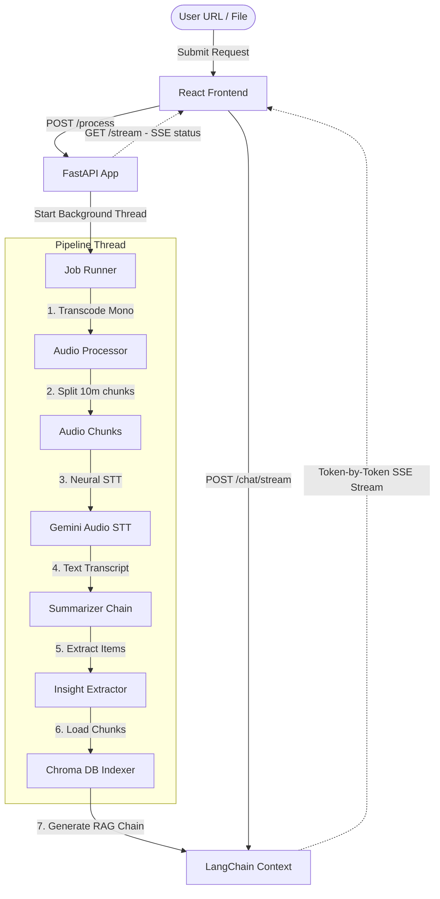
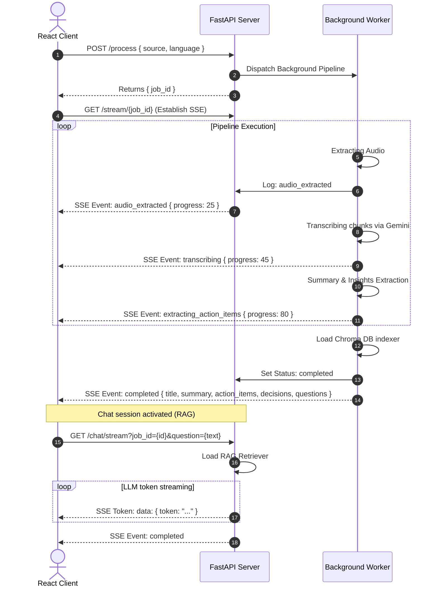

# MEETMIND AI (AI-Powered Video & Meeting Assistant)

An advanced, recruiter-ready, real-time AI Meeting & Video Assistant. Paste a YouTube URL or specify a local video/audio file path, and the application transcribes, translates, summarizes, and extracts key decisions and action items. Includes a Retrieval-Augmented Generation (RAG) conversational interface to chat token-by-token with the meeting transcript content.

Redesigned with a modern **Server-Sent Events (SSE)** architecture, the frontend streams intermediate stage milestones in real-time to prevent long I/O wait times.

---

## 🌟 Key Features

- **Real-Time Pipeline Progress (SSE)**: Streams job statuses (`processing_started`, `audio_extracted`, `transcribing`, `transcription_completed`, `generating_summary`, `extracting_action_items`, `extracting_decisions`, `extracting_questions`, `building_rag`, `completed`) directly to the client with robust termination handlers to prevent infinite reconnection loops.
- **Consolidated AI Analysis**: Consolidates meeting summary, action items, key decisions, and follow-up questions into a **single structured LLM request**, improving speeds by 10x and fully eliminating API rate limits.
- **AI-Powered Audio Transcription**: Uses the Google GenAI **Gemini** API to securely and rapidly transcribe audio files.
- **Persistent Job Caching**: Avoids redundant LLM & transcription processing costs by storing processed job outputs and global text embedding vectors in a persistent disk cache.
- **Isolated Vector RAG Querying**: Tags vectorized transcript chunks with a unique `job_id` and applies isolated metadata filtering, guaranteeing that chat responses contain zero cross-talk between different meetings.
- **Context Citations & Sources**: Renders real-time citation links and transcript source snippets (with time offsets) alongside streamed tokens in the Chat interface.
- **Hierarchical Summarization**: Extracts bulletproof executive summaries, action items (tasks, owners, and deadlines), key decisions, and open questions using LLM reasoning structures.
- **RAG Chat Window (Streaming)**: Connects to a local **Chroma DB** collection, prompting LLMs to answer questions based ONLY on the context. Streams answers token-by-token using SSE.
- **Document Exporting**: Supports client-side downloads as standard Markdown (`.md`) and compiles print-ready PDFs directly in the browser.
- **Premium SaaS Dashboard**: High-fidelity UI using **React 19**, **Vite**, **Tailwind CSS**, and spring-animated micro-interactions powered by **Framer Motion**. Offers collapsible results, copy-to-clipboard blocks, dark mode, and layout transitions.

---

## 🛠️ Tech Stack

### Frontend
- **React 19** & **Vite** (Next-generation lightning-fast frontend bundler)
- **Tailwind CSS** (Utility-first styling framework with full light/dark theme systems)
- **Framer Motion** (Production-ready spring physics animation library)
- **React Router Dom v6** (Client-side routing engine)
- **Axios** (Promise-based REST API requester)
- **Lucide React** (Clean SVG iconography)

### Backend
- **FastAPI** (High-performance, asynchronous web server framework in Python)
- **LangChain** (LLM flow orchestrator & retrieval pipelines)
- **Chroma DB** (High-density vector database)
- **Gemini Audio STT** (Automatic high-fidelity speech-to-text)
- **Uvicorn** (Asynchronous ASGI server)

---

## 📐 System Architecture

### Pipeline Block Diagram


### SSE Communication Sequence


---

## 📁 Folder Structure

```
.
├── backend/                    # FastAPI Server and Streamlit app
│   ├── app.py                  # Streamlit UI interface
│   ├── main.py                 # FastAPI entrypoint & SSE streaming endpoints
│   ├── requirements.txt        # Python dependency specifications
│   ├── core/                   # Core LLM pipelines & model loaders
│   │   ├── analysis.py         # Consolidated meeting analysis module
│   │   ├── extractor.py        # Legacy wrappers for actions, decisions, and questions
│   │   ├── llm.py              # Generative AI client loader
│   │   ├── rag_engine.py       # Context retrievers & LangChain RAG builders
│   │   ├── summarize.py        # Legacy wrappers for summaries
│   │   └── vector_store.py     # Simple Chroma DB collection store & embedders
│   └── utils/                  # Utility modules
│       ├── audio_processor.py  # Audio transcoding, caching, and downsampling
│       └── cache.py            # Local JSON job execution cache
├── downloads/                  # Directory for cached audio and vector stores
└── frontend/                   # Vite React app
    ├── index.html              # HTML DOM viewport
    ├── package.json            # React bundle declarations
    ├── postcss.config.js       # CSS preprocessing
    ├── tailwind.config.js      # CSS design tokens & utilities config
    └── src/
        ├── App.jsx             # Router layout & page routing paths
        ├── main.jsx            # React root renderer
        ├── index.css           # Global custom classes & Tailwind base
        ├── assets/             # Assets and media
        ├── context/
        │   └── AppContext.jsx  # Context provider (Dark mode, LocalStorage history)
        ├── hooks/
        │   └── useSSE.js       # Reusable SSE subscriber hook with auto-retry
        ├── services/
        │   ├── api.js          # REST API endpoints wrapper (Axios)
        │   └── sse.js          # Vanilla EventSource helpers
        ├── components/
        │   ├── Navbar.jsx      # Navigation bar with dark mode toggle
        │   ├── Sidebar.jsx     # Analysis history listing sidebar
        │   ├── Footer.jsx      # Footer information wrapper
        │   ├── ConnectionStatusBadge.jsx  # Connection diagnostic indicator
        │   ├── Toast.jsx       # Alert feedback box (Framer Motion)
        │   └── Modal.jsx       # Dialog popup container
        └── pages/
            ├── Home.jsx        # Landing hero and sequence features
            ├── ProcessPage.jsx # Submission forms and Terminal Progress consoles
            ├── ResultsDashboard.jsx # Summary views, Markdown/PDF download controls
            ├── ChatPage.jsx    # Stream RAG chatting log and MD renderer
            ├── About.jsx       # Tech stack descriptions
            └── NotFound.jsx    # 404 page
```

---

## 🔌 API Documentation

### 1. Trigger Video/Audio Processing
Asynchronously enqueues a source video file or YouTube URL for analysis.
- **URL**: `/process`
- **Method**: `POST`
- **Request Body**:
  ```json
  {
    "source": "https://www.youtube.com/watch?v=dQw4w9WgXcQ",
    "language": "english"
  }
  ```
- **Response Body**:
  ```json
  {
    "job_id": "36f88fc1-dbfa-469c-b44b-a63b654acb1a"
  }
  ```

### 2. Stream Job Processing Status
EventSource-compatible Server-Sent Events endpoint detailing real-time logs and progress.
- **URL**: `/stream/{job_id}`
- **Method**: `GET`
- **Response Headers**: `Content-Type: text/event-stream`
- **Stream Event Sequences**:
  - `processing_started`
    ```
    event: processing_started
    data: {"status": "running", "progress": 5}
    ```
  - `audio_extracted`
    ```
    event: audio_extracted
    data: {"status": "running", "progress": 25, "chunks_count": 3}
    ```
  - `transcribing`
    ```
    event: transcribing
    data: {"status": "running", "progress": 38, "chunk": 1, "total_chunks": 3, "message": "Transcribing chunk 1 of 3"}
    ```
  - `completed`
    ```
    event: completed
    data: {
      "status": "completed",
      "progress": 100,
      "title": "React 19 Feature Set",
      "summary": "- Overview of React...",
      "action_items": "1. Deploy code (John)",
      "decisions": "1. Adopt React Router...",
      "questions": "1. What is the deadline?"
    }
    ```

### 3. Stream RAG Chat Response
Streams conversational LLM tokens answering a question about the meeting context.
- **URL**: `/chat/stream`
- **Method**: `GET` (EventSource compatible)
- **Query Parameters**:
  - `job_id`: `"36f88fc1-dbfa-469c-b44b-a63b654acb1a"`
  - `question`: `"What decisions were made?"`
- **Response Headers**: `Content-Type: text/event-stream`
- **Stream Event Sequences**:
  - Tokens:
    ```
    data: {"token": "The "}
    
    data: {"token": "meeting "}
    
    data: {"token": "decided "}
    ```
  - Completion:
    ```
    event: completed
    data: {}
    ```

*(Note: A `POST /chat/stream` endpoint accepting the same payload as a JSON body is also supported for fetch-based clients).*

---

## ⚙️ Environment Variables

Create a `.env` file in the backend directory. Placeholders:
```env
# Models
MODEL=gemini-2.5-flash

# API Keys
GOOGLE_API_KEY=your-gemini-api-key-here
```

---

## 🚀 Installation & Running

### Prerequisites
- Python 3.10+
- Node.js 18+
- Ffmpeg installed on your path (for audio transcoding and downsampling)
  - macOS: `brew install ffmpeg`
  - Linux: `sudo apt install ffmpeg`

### Backend Setup
1. Create a virtual environment and activate it:
   ```bash
   python3 -m venv .venv
   source .venv/bin/activate
   ```
2. Install dependencies:
   ```bash
   pip install -r requirements.txt
   ```
3. Run the FastAPI development server:
   ```bash
   python3 -m uvicorn main:app --port 8000 --reload
   ```

### Frontend Setup
1. Navigate to the frontend directory:
   ```bash
   cd frontend
   ```
2. Sync node modules:
   ```bash
   npm install --legacy-peer-deps
   ```
3. Launch local dev server:
   ```bash
   npm run dev
   ```
4. Access the web interface in your browser at `http://localhost:5173`.

---

## 📝 License

This project is licensed under the MIT License.
