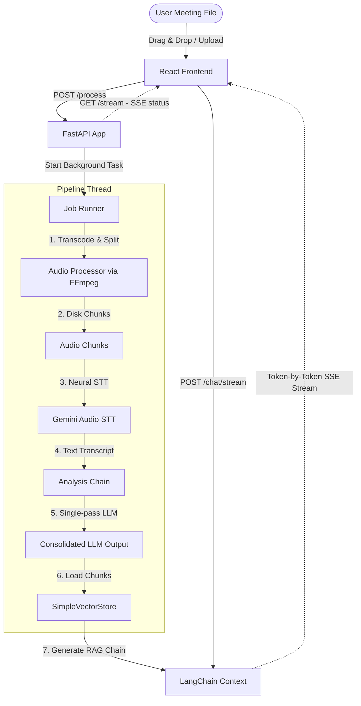
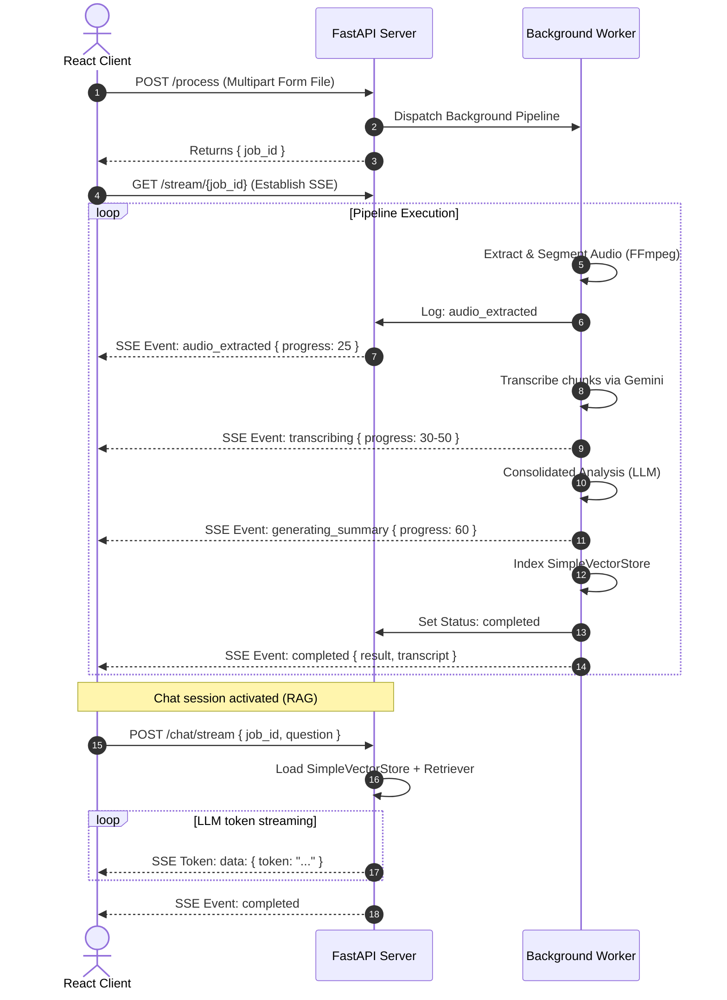

# MEETMIND AI: Production-Ready AI Video & Meeting Assistant

An advanced, production-grade, real-time AI Meeting & Video Assistant. Users upload meeting recording files (audio or video), and the application transcribes, translates, summarizes, and extracts key decisions and action items. It includes an isolated Retrieval-Augmented Generation (RAG) conversational interface to chat with the transcript content.

Designed with a modern **Server-Sent Events (SSE)** architecture, the frontend streams intermediate pipeline stage milestones in real-time to prevent long I/O wait times. The system is engineered to run seamlessly on resource-constrained environments (like Render's free tier with a 512MB RAM ceiling) through direct `ffmpeg` out-of-process audio downsampling and chunk segmentation, deterministic content-hash caching, and immediate garbage-collection cleanup of temporary chunk assets.

---

## 🌟 Key Features

- **Real-Time Pipeline Progress (SSE)**: Streams job statuses (`processing_started`, `audio_extraction_started`, `audio_extracted`, `transcribing`, `transcription_completed`, `generating_summary`, `generating_title`, `extracting_action_items`, `extracting_decisions`, `extracting_questions`, `building_rag`, `completed`) directly to the client with robust termination handlers to prevent infinite reconnection loops.
- **Memory-Optimized Processing**: Uses `ffmpeg` as a subprocess to transcode, downsample to 16kHz mono, and segment audio files into 10-minute segments directly on disk. This completely avoids loading raw files into Python process RAM, fitting under Render's 512MB limit.
- **Eager Asset Cleanup**: Temporary uploaded files and segments are immediately deleted as soon as their step finishes, preventing storage overflows.
- **Consolidated AI Analysis**: Consolidates meeting summary, action items, key decisions, and follow-up questions into a **single structured LLM request**, improving speeds by 10x and fully eliminating API rate limits.
- **Deterministic Job Caching**: Avoids redundant LLM & transcription processing costs by storing processed job outputs and global text embedding vectors in a persistent local cache. Looks up matching runs instantly using file SHA-256 hashes.
- **Custom persistent Vector Database**: Uses `SimpleVectorStore` (a lightweight, local pickle-based vector store) supporting cosine similarity over Gemini embeddings. This eliminates extra database server overhead.
- **Isolated Vector RAG Querying**: Tags vectorized transcript chunks with a unique `job_id` and applies isolated metadata filtering, guaranteeing that chat responses contain zero cross-talk between different meetings.
- **Context Citations & Sources**: Renders real-time citation links and transcript source snippets (with chunk index offsets) alongside streamed tokens in the Chat interface.
- **Premium SaaS Dashboard**: High-fidelity UI using **React 19**, **Vite**, **Tailwind CSS**, and spring-animated micro-interactions powered by **Framer Motion**. Offers collapsible results, copy-to-clipboard blocks, dark/light theme toggle, and layout transitions.
- **Backend Status Diagnostics**: Includes an automatic health diagnostic loop in AppContext that pings the backend. Shows warning banners if the backend is cold-starting (e.g. Render free tier sleep) and badges to indicate `CONNECTED` or `WAKING_UP` state.
- **Size Safeguards**: Restricts file uploads to a `1MB` to `300MB` range, enforced on both the React drag-and-drop uploader and the FastAPI endpoint.
- **Document Exporting**: Supports client-side downloads as standard Markdown (`.md`) and compiles print-ready PDFs directly in the browser.

---

## 🛠️ Tech Stack

### Frontend
- **React 19** & **Vite** (Next-generation lightning-fast frontend bundler)
- **Tailwind CSS** (Utility-first styling framework with full light/dark theme systems)
- **Framer Motion** (Production-ready spring physics animation library)
- **React Router Dom v6** (Client-side routing engine)
- **Axios** (Promise-based REST API requester)
- **Lucide React** (Clean SVG iconography)

### Backend
- **FastAPI** (High-performance, asynchronous web server framework in Python)
- **LangChain** (LLM flow orchestrator & retrieval pipelines)
- **SimpleVectorStore** (Custom persistent Pickle + Cosine Similarity Vector Database)
- **Gemini 3.1 Flash-Lite**: Used for fast, high-quality audio Speech-to-Text (STT) transcription via the Google GenAI SDK.
- **Gemini 2.5 Flash** (or custom configured model): Used for consolidated meeting analysis and RAG conversational chat, loaded via LangChain.
- **Uvicorn** (Asynchronous ASGI server)
- **ffmpeg** (System utility for audio transcoding and segment splitting)

---

## 📐 System Architecture

### Pipeline Block Diagram


### SSE Communication Sequence


---

## 📁 Repository Layout

```
.
├── backend/                    # FastAPI Backend Service
│   ├── main.py                 # FastAPI entrypoint, routes, and job management
│   ├── requirements.txt        # Python dependency specifications
│   ├── core/                   # LLM & Vector Storage pipelines
│   │   ├── analysis.py         # Consolidated LLM analysis generation
│   │   ├── extractor.py        # Analysis compatibility layers
│   │   ├── llm.py              # Google GenAI Gemini model loader
│   │   ├── rag_engine.py       # LangChain LCEL RAG builders and prompt engineering
│   │   ├── summarize.py        # Analysis compatibility layers
│   │   ├── transcriber.py      # Gemini STT transcription orchestrator
│   │   └── vector_store.py     # Custom persistent SimpleVectorStore
│   └── utils/                  # Backend utilities
│       ├── audio_processor.py  # subprocess ffmpeg split and downsampling logic
│       └── cache.py            # Local cache matching file hashes to results
├── downloads/                  # Local persistence directory (pickle stores & JSON cache)
└── frontend/                   # React Single Page Application (Vite project)
    ├── index.html              # HTML DOM entrypoint
    ├── package.json            # React bundle configuration
    ├── postcss.config.js       # PostCSS styling configs
    ├── tailwind.config.js      # Tailwind UI themes and customization tokens
    └── src/
        ├── App.jsx             # React client-side Router paths
        ├── main.jsx            # React root component renderer
        ├── index.css           # Global custom classes & Tailwind base
        ├── App.css             # Page/Layout specific styles
        ├── assets/             # Images and design resources
        ├── context/
        │   └── AppContext.jsx  # AppContext (Dark mode, local storage history, backend availability diagnostics)
        ├── hooks/
        │   └── useSSE.js       # SSE event hook with auto-retry
        ├── services/
        │   ├── api.js          # REST API endpoints client (Axios)
        │   └── sse.js          # EventSource instantiation helper
        ├── components/
        │   ├── Navbar.jsx      # Navigation bar & theme switcher
        │   ├── Sidebar.jsx     # Persistent analysis history list
        │   ├── Footer.jsx      # Layout footer component
        │   ├── ConnectionStatusBadge.jsx  # Diagnostic backend checker badge
        │   ├── Toast.jsx       # Custom notification bubbles
        │   └── Modal.jsx       # Confirmation dialog boxes
        └── pages/
            ├── Home.jsx        # Landing page with key feature list
            ├── ProcessPage.jsx # Drag-and-drop uploader & live SSE console logs
            ├── ResultsDashboard.jsx # Collapsible tabs, Copy, Print/PDF/Markdown export options
            ├── ChatPage.jsx    # Stream RAG chatting log and MD renderer
            ├── About.jsx       # High-level architecture walkthrough
            └── NotFound.jsx    # 404 fallback page
```

---

## 🔌 API Documentation

### 1. Health Status Ping
Checks server availability.
- **URL**: `/`
- **Method**: `GET`
- **Response**:
  ```json
  {"message": "AI Video Assistant is running!"}
  ```

### 2. Trigger Recording Analysis
Uploads recording file (1MB - 300MB) and enqueues background processing.
- **URL**: `/process`
- **Method**: `POST`
- **Request Type**: `multipart/form-data`
- **Form Data Fields**:
  - `file`: The raw audio/video file (supported extensions: `.mp4`, `.mp3`, `.wav`, `.mov`, `.m4a`, `.aac`)
  - `language`: Target transcription language, either `"english"` or `"hinglish"` (defaults to `"english"`)
- **Response Body**:
  ```json
  {
    "job_id": "36f88fc1-dbfa-469c-b44b-a63b654acb1a"
  }
  ```

### 3. Stream Job Processing Status
EventSource Server-Sent Events endpoint detailing real-time logs and progress.
- **URL**: `/stream/{job_id}`
- **Method**: `GET`
- **Response Headers**: `Content-Type: text/event-stream`
- **Stream Event Sequences**:
  - `processing_started`
    ```
    event: processing_started
    data: {"status": "running", "progress": 5}
    ```
  - `audio_extracted`
    ```
    event: audio_extracted
    data: {"status": "running", "progress": 25, "chunks_count": 3}
    ```
  - `transcribing`
    ```
    event: transcribing
    data: {"status": "running", "progress": 38, "chunk": 1, "total_chunks": 3, "message": "Transcribing chunk 1 of 3"}
    ```
  - `completed`
    ```
    event: completed
    data: {
      "status": "completed",
      "progress": 100,
      "title": "Project Kickoff",
      "summary": "- Overview of tasks...",
      "action_items": "1. Deploy code (John)",
      "decisions": "1. Adopt React Router...",
      "questions": "1. What is the deadline?",
      "transcript": "Full text transcript..."
    }
    ```

### 4. Stream RAG Chat Response
Streams conversational LLM tokens answering a question about the meeting context.
- **URL**: `/chat/stream`
- **Method**: `POST`
- **Request Payload**:
  ```json
  {
    "job_id": "36f88fc1-dbfa-469c-b44b-a63b654acb1a",
    "question": "What decisions were made?"
  }
  ```
- **Response Headers**: `Content-Type: text/event-stream`
- **Stream Event Sequences**:
  - Sources citation metadata:
    ```
    event: sources
    data: [{"chunk_index": 2, "content": "..."}]
    ```
  - Tokens:
    ```
    data: {"token": "The "}
    data: {"token": "meeting "}
    ```
  - Completion:
    ```
    event: completed
    data: {}
    ```

---

## ⚙️ Environment Configuration

Create a `.env` file in the `backend/` directory:
```env
# Models
MODEL=gemini-2.5-flash

# API Keys
GOOGLE_API_KEY=your-gemini-api-key-here
```

---

## 🚀 Getting Started

### Prerequisites
* **Python 3.10+**
* **Node.js 18+**
* **FFmpeg** installed on your system's PATH:
  * macOS: `brew install ffmpeg`
  * Linux: `sudo apt install ffmpeg`
  * Windows: Download zip, extract, and add binary folder to system environment variables.

### Backend Setup
1. Navigate to the backend directory:
   ```bash
   cd backend
   ```
2. Initialize virtual environment:
   ```bash
   python3 -m venv .venv
   source .venv/bin/activate
   ```
3. Install dependencies:
   ```bash
   pip install -r requirements.txt
   ```
4. Run server:
   ```bash
   python3 -m uvicorn main:app --port 8000 --reload
   ```

### Frontend Setup
1. Navigate to the frontend directory:
   ```bash
   cd frontend
   ```
2. Install dependencies:
   ```bash
   npm install
   ```
3. Run the Vite developer server:
   ```bash
   npm run dev
   ```
4. Open the displayed URL (usually `http://localhost:5173`) in your web browser.

---

## 📝 License

This project is licensed under the MIT License.
